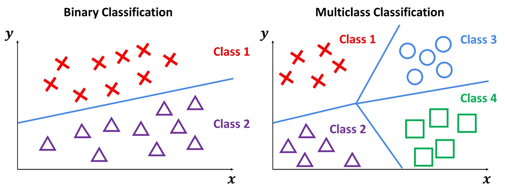
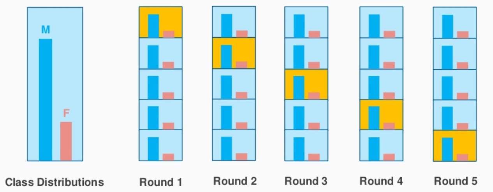

```{r setup, include=FALSE, echo=FALSE}
library(prettydoc)
library(dplyr)
library(pROC)
library(corrplot)  # for the correlation plot
library(discrim)  # for linear discriminant analysis
library(corrr)   # for calculating correlation
library(knitr)   # to help with the knitting process
library(MASS)    # to assist with the markdown processes
library(tidyverse)
library(tidymodels)
library(ggplot2)   # for most of our visualizations
library(ggrepel)
library(ggimage)
library(rpart.plot)  # for visualizing trees
library(vip)         # for variable importance 
library(vembedr)     # for embedding links
library(janitor)     # for cleaning out our data
library(yardstick) # for measuring certain metrics
library(glmnet)
library(modeldata)
library(ggthemes)
library(naniar) # to assess missing data patterns
library(themis) # for upsampling
library(ranger)
library(finalfit) # visualizing missing data
tidymodels_prefer()


knitr::opts_chunk$set(   # basic chunk settings
    echo = TRUE,
    message = FALSE,
    warning = FALSE,
    fig.height = 5,
    fig.width = 7,
    tidy = TRUE,
    tidy.opts = list(width.cutoff = 60)
)

opts_chunk$set(tidy.opts=list(width.cutoff=60),tidy=TRUE)
options(digits = 4)

set.seed(123) # Initial set seed for reproducibility

indent1 = '    '        # basic indent settings
indent2 = '        '
indent3 = '            '
```


## Introduction

In this machine learning project, our primary goal is to develop a model capable of swiftly and accurately predicting dangerous driving behavior. Aggressive driving actions, such as speeding, abrupt braking, and sudden turns, are crucial factors in numerous fatal crashes, constituting over half of reported incidents. Our focus lies in enhancing road safety by anticipating and classifying driving behaviors. 

<div style="text-align:center;">
  
</div>

### Inspiration and Motive

Imagine a world where road users are informed in real-time about potentially dangerous driving behaviors, allowing them to adjust and respond proactively. Inspired by the desire to mitigate road accidents and ensure the safety of individuals, this project aims to provide a technological solution. The prediction of aggressive driving behaviors seeks to contribute to a safer and more secure road environment. The motivation stems from the belief that technology can play a pivotal role in preventing accidents and safeguarding lives.

Understanding the motivation behind predicting aggressive driving behavior is crucial. Forecasting dangerous driving actions facilitates informed decision-making on the road. This model aims to be a proactive tool, not only for individual drivers but also for broader applications in enhancing road safety measures.

Our model incorporates data-driven insights into the realm of driving behavior. The relevance of this model lies in its potential to empower drivers, passengers, and even automated systems with the ability to anticipate and respond to aggressive driving actions, ultimately contributing to a safer and more secure road ecosystem.

<div style="text-align:center;">
  
</div>

### Dataset Description

The dataset at hand focuses on predicting driving behavior, specifically targeting aggressive driving actions that contribute significantly to road traffic accidents. The data was collected using an Android application designed to utilize the accelerometer and gyroscope sensors on smartphones, with a specific emphasis on a Samsung Galaxy S21 device. The recorded information includes acceleration and rotation data along the X, Y, and Z axes, timestamp information, and classification labels indicating whether the driving behavior is categorized as Slow, Normal, or Aggressive. Noteworthy aspects of the dataset include a sampling rate of 2 samples per second, removal of gravitational acceleration, and the use of sensors for data collection.

You can visit the data set information on Kaggle [here](https://www.kaggle.com/datasets/outofskills/driving-behavior/data).

### Project Roadmap

In embarking on the development of our machine learning model to predict aggressive driving behavior, we will begin by collecting and preprocessing data through an Android application specifically designed for this purpose on the Samsung Galaxy S21. The dataset, derived from accelerometer and gyroscope sensors, will undergo thorough cleaning and gravitational acceleration removal to ensure data integrity. Subsequently, an in-depth Exploratory Data Analysis (EDA) will be conducted, visually inspecting acceleration and rotation patterns for each driving behavior category—Slow, Normal, and Aggressive. Feature engineering will follow, extracting pertinent features and encoding categorical labels for predictive modeling.

Upon completing data preparation, we will execute a training/test split and establish a robust 10-fold cross-validation strategy for model validation. Multiple classification models, including Logistic Regression, Decision Trees, Random Forest, and others, will be implemented and evaluated based on cross-validated metrics. The models will undergo training and evaluation, with performance metrics such as accuracy, precision, recall, and F1 score analyzed comprehensively. Model comparison will guide the selection of the most effective predictive model for aggressive driving behavior.

The chosen model will then undergo deployment and testing in real-world or simulated driving scenarios to assess its accuracy and effectiveness. Fine-tuning and optimization iterations will follow, focusing on hyperparameter adjustments to enhance predictive capabilities and optimize the model for real-time predictions. Finally, comprehensive documentation will be provided, summarizing key findings, insights, and the model's usage instructions for future reference. This systematic roadmap aims to drive the project toward success, ultimately contributing to enhanced road safety through the prediction of aggressive driving behaviors.

## Exploratory Data Analysis

Before delving into the modeling phase, a critical step is to conduct an in-depth exploration of our dataset. The raw data, collected through smartphone sensors capturing accelerometer and gyroscope information, may require careful examination and preparation before its application in predictive modeling. Initial data loading may reveal imperfections such as variables needing conversion to factors or missing values requiring attention. 

Our primary objective is to create a response variable that distinctly categorizes whether a driving scenario is classified as Slow, Normal, or Aggressive. This involves meticulous data manipulation and cleaning to ensure the dataset's readiness for subsequent analysis. Variables may need to be transformed or encoded, and missing values addressed before moving forward.

In this exploratory data analysis (EDA) section, we will systematically navigate through data manipulation and tidying processes, setting the stage for a comprehensive understanding of the dataset. Visualizations and analytical functions will be employed to scrutinize key variables, unveiling patterns, distributions, and potential correlations. This critical phase is pivotal in laying the groundwork for robust predictive modeling, ensuring that our data is not only pristine but also conducive to extracting meaningful insights for the task of predicting driving behavior accurately.

### Loading and Exploring Raw Data

In this section, we initiate the exploration of our motion data collected through accelerometer and gyroscope sensors. The dataset was conveniently divided into training and testing sets, but for our customized analysis, we decide to combine them and create a distinct split.

```{r}
# Read the datasets
train <- read.csv('~/Github/pstat131FinalProject/data/train_motion_data.csv')
test <- read.csv('~/Github/pstat131FinalProject/data/test_motion_data.csv')

# Combine the datasets
combined_data <- rbind(train, test)

# Check the dimensions of the combined dataset
dim(combined_data)

# Export the combined dataset to a new CSV file
#write.csv(combined_data, '~/Github/pstat131FinalProject/data/combined_motion_data.csv', row.names = FALSE)
```

The resultant combined dataset boasts a substantial 6728 rows and 8 columns, ensuring an ample amount of data for our machine learning model to glean meaningful insights effectively.


Now lets take a look at the variables:

```{r}
combined_data %>% head()
```

### Variable Description

Response Variable: 

- `Class`: A categorical variable (factor) indicating the driving behavior classification, which includes categories such as SLOW, NORMAL, and AGGRESSIVE.

Predictor Variables:

- `AccX`: A numerical variable representing acceleration along the X-axis in meters per second squared (m/s²).
- `AccY`: A numerical variable representing acceleration along the Y-axis in meters per second squared (m/s²).
- `AccZ`: A numerical variable representing acceleration along the Z-axis in meters per second squared (m/s²).
- `GyroX`: A numerical variable representing rotation along the X-axis in degrees per second (°/s).
- `GyroY`: A numerical variable representing rotation along the Y-axis in degrees per second (°/s).
- `GyroZ`: A numerical variable representing rotation along the Z-axis in degrees per second (°/s).

Variables not used in prediction:

- `Timestamp`: An integer variable representing time in seconds.


Our dataset encompasses a range of variables contributing to the comprehensive analysis of driving behavior. Here's a breakdown of each variable:

**Response Variable:**

- `Class`: This categorical variable (factor) serves as our response variable, indicating the classification of driving behavior. The classes include SLOW, NORMAL, and AGGRESSIVE.

**Predictor Variables:**

- `AccX`, `AccY`, `AccZ`: These numerical variables represent acceleration along the X, Y, and Z axes, respectively, measured in meters per second squared (m/s²). They provide insights into the vehicle's linear acceleration in different directions.

- `GyroX`, `GyroY`, `GyroZ`: These numerical variables capture rotation along the X, Y, and Z axes, measured in degrees per second (°/s). They offer valuable information about the vehicle's rotational movements.

**Variables not used in prediction:**

- `Timestamp`: While not utilized in prediction, this integer variable represents time in seconds. It could be leveraged for time-based analysis or sequencing of events.


### Data Visualization

#### Acceleration along the X-axis over time

```{r}
# Visualization of Accelerometer readings
ggplot(combined_data, aes(x = Timestamp, y = AccX, color = Class)) +
  geom_line() +
  labs(title = "Acceleration along X-axis Over Time", x = "Timestamp", y = "AccX") +
  theme_minimal()
```

The visualization illustrates the dynamic nature of acceleration along the X-axis over time, segmented by driving behavior classes. Aggressive drivers exhibit more pronounced and frequent acceleration spikes compared to normal and slow drivers. This suggests a distinct pattern in the acceleration behavior of different driving styles. Such insights can be pivotal for understanding and predicting driver behavior in real-world scenarios.

#### Correlation matrix

```{r}
# Correlation matrix for numerical variables
cor_matrix <- cor(combined_data[, c("AccX", "AccY", "AccZ", "GyroX", "GyroY", "GyroZ")])
corrplot(cor_matrix, method = "color", addCoef.col = "black")
```

The correlation matrix reveals interesting relationships between the numerical variables related to accelerometer and gyroscope readings. Notably, there is a minimal negative correlation between GyroZ and AccX. This negative correlation suggests a potential influence of down-force during acceleration. For instance, when launching a car, the front tends to lower while the rear lifts, leading to the observed correlation. Understanding these correlations adds depth to our insights into the physical dynamics associated with different driving behaviors.


#### Distribution of Driving Behavior Classes

```{r}
# Plot the distribution of the 'Class' variable
ggplot(combined_data, aes(x = Class, fill = Class)) +
  geom_bar() +
  labs(title = "Distribution of Driving Behavior Classes", x = "Class", y = "Count") +
  theme_minimal()
```

The distribution plot illustrates a balanced representation of driving behavior classes, with each class appearing in a relatively similar frequency. This balanced distribution is advantageous for our modeling approach, as it ensures that the model is exposed to a sufficient number of instances for each class. This balance reduces the risk of model bias towards a particular class, enhancing the reliability of our driving behavior classification model. The equitable representation of classes contributes to the robustness and fairness of our predictive model.


#### Solution to Missing Data

It is possible for the sensors to mal-function so let's check for missing data in our data set just in case!

```{r}
combined_data %>% missing_plot()
```

The absence of missing data in our dataset is a positive indication of data integrity. Missing data can significantly impact the performance and reliability of a machine learning model. The fact that we have a complete dataset ensures that our model will have sufficient information to learn and make accurate predictions. This quality check enhances the robustness of our analysis and instills confidence in the subsequent steps of our modeling process. With a complete dataset, we can proceed with greater assurance in building a dependable driving behavior classification model.

## Multiclass Classification vs. Binary Classification

<div style="text-align:center;">
  
</div>

### Rationale for Multiclass Classification

We aim to employ multiclass classification to discern the subtleties inherent in various driving behaviors, delineated by the SLOW, NORMAL, and AGGRESSIVE classes. It is crucial to note that multiclass classification may entail a trade-off, potentially resulting in lower accuracy compared to binary class classification. The computational demands are also heightened in multiclass scenarios, prompting consideration for a potential shift toward binary classification.

### Transition to Binary Classification

Moreover, the overarching goal of constructing a driving behavior classification model is twofold: to enhance road safety and security and to furnish valuable insights for insurance companies. As we navigate this objective, a compelling proposition emerges—to designate SLOW and NORMAL drivers collectively as SAFE drivers. This not only simplifies the classification process but also aligns with our mission to contribute to a safer driving environment.

## Setting Up Models

### Factoring Response Variable

```{r}
combined_data <- combined_data %>%
  mutate(
    Class = as.factor(Class)
  )

head(combined_data)
```

### Train/Test Split

Perform an initial split of the data. Stratify by the outcome variable.

```{r}
# Set a seed for reproducibility
set.seed(123)

# Define the percentage for the training set (e.g., 80%)
train_percent <- 0.8

# Create a data splitting object with stratified sampling
data_split <- initial_split(combined_data, prop = train_percent, strata = Class)

# Extract the training and testing sets
data_train <- training(data_split)
data_test <- testing(data_split)

# Check the dimensions of the training and testing sets
dim(data_train)
dim(data_test)
```

We have successfully performed an initial split of the data, with 80% allocated to the training set (`data_train`) and 20% to the testing set (`data_test`). The dimensions of the training set are 5381 rows and 8 columns, while the testing set comprises 1347 rows and 8 columns. This stratified split ensures a representative distribution of the outcome variable, `Class`, in both sets, enhancing the reliability of our subsequent analyses and model training.

### *k*-fold cross-validation

<div style="text-align:center;">
  
</div>

**1. What is *k*-fold cross-validation?**

*k*-fold cross-validation is a resampling technique used to assess the performance and generalizability of a predictive model. In this approach, the original training dataset is randomly partitioned into *k* equally sized folds. The model is trained *k* times, each time using a different fold as the test set and the remaining folds as the training set. This process results in *k* performance metrics, usually averaged to provide a more robust estimate of the model's performance.

**2. Why should we use *k*-fold cross-validation?**

*k*-fold cross-validation is employed to obtain a more reliable estimate of a model's performance compared to a single train-test split. By training and evaluating the model multiple times on different subsets of the data, *k*-fold cross-validation helps to ensure that the model's performance is representative across various data partitions. This is particularly important because the performance of a model can be sensitive to the specific data points in a single train-test split. Using multiple folds allows for a better understanding of the model's stability and generalization capabilities.

We will use *k*-fold cross-validation with k = 5.

```{r}
# Set seed for reproducibility
set.seed(123)

# Define the number of folds
num_folds <- 5

# Create a cross-validation object
data_folds <- vfold_cv(data_train, v = num_folds, strata = "Class")
```

### Create Recipe

Set up a recipe to predict `Class` with `AccX`, `AccY`, `AccZ`, `GyroX`, `GyroY`, `GyroZ`.

-   Center and scale all predictors. 

We will not be including `Timestamp` as a predictor as it will lead to over-fitting.  This is because the classes are ordered by `Timestamp` by the nature of the data collection process. Rows with similar `Timestamp` are very likely to have the same class. Hence the `Timestamp` variable should be omitted.

```{r}
# Create a recipe
data_recipe <- recipe(Class ~ AccX + AccY + AccZ + GyroX + GyroY + GyroZ, data = data_train) %>%
  
  # Center and scale all predictors
  step_normalize(all_predictors())
```

The recipe includes a normalization step where all predictors are centered and scaled. This preprocessing step ensures that the features are on a comparable scale, preventing any single variable from disproportionately influencing the model. This normalization is especially valuable when working with algorithms that are sensitive to the scale of input features.


We will save the key components of our model setup to an RDA file considering the significant computing time required for building models. By preserving data_folds, data_recipe, data_train, and data_test in a stored file (Model_Setup.rda), we ensure the ability to revisit the entire modeling process later.

```{r}
save(data_folds, data_recipe, data_train, data_test, file = "~/Github/pstat131FinalProject/RDA/Model_Setup.rda")
```


## Building Prediction Models

The culmination of our efforts leads us to the pivotal phase of constructing prediction models for driving behavior. Given the relatively mid-size of our dataset, the advantage of swift model execution enabled us to explore diverse variations and fine-tune hyperparameters to achieve optimal model performance. Despite the computational demands of these models, each was efficiently executed by running individual R scripts with the preloaded dataset, ensuring a seamless workflow. The results, in the form of RDA files, have been meticulously organized in the Models and RDA folders within the dedicated GitHub repository for this project, accessible [here](https://github.com/koitaku2323/pstat131FinalProject).

As articulated earlier, our model selection comprised seven distinct techniques, namely Logistic Regression, K-Nearest Neighbors, Linear Discriminant Analysis (LDA), Quadratic Discriminant Analysis (QDA), Elastic Net, Multinomial Regression, and Random Forest models. We implemented and tested these models in binary classification and multi-class classification settings.

### Performance Metric & Model Building Process

<div style="text-align:center;">
  
</div>

The metric chosen to gauge model performance is roc_auc, emphasizing efficiency in binary classification scenarios with imbalanced data. This metric calculates the area under the curve for the receiver operating characteristic (ROC) curve, providing insights into the trade-off between sensitivity and specificity. The success of this approach was evident across almost all models, following a standardized process outlined below:

1. Set up the model by specifying type, engine, and mode (classification).
2. Establish the workflow, incorporating the new model and the predefined recipe.

Skip steps 3-6 for Logistic Regression, LDA, and QDA.

3. Configure the tuning grid, specifying parameters for optimization and desired tuning levels.
4. Tune the model with chosen parameters.
5. Select the most accurate model from the tuning process.
6. Finalize the workflow with the chosen tuning parameters.
7. Fit the model to the training dataset within the workflow.
8. Save the results to an RDA file, optimizing efficiency by eliminating the need for repeated execution.

This systematic model-building approach ensures not only the precision of our models but also facilitates streamlined exploration of results for comprehensive analysis.

### Model Results

With our models successfully built and stored, along with their respective outcomes and scores, we're poised to delve into a comprehensive analysis of their individual performances. The repertoire includes five Multi-class Models and three Binary Class Models, showcasing the diversity of our exploration.

Let's proceed by loading the saved results of each model and embark on a detailed examination of their effectiveness.

```{r}
load("~/Github/pstat131FinalProject/RDA/motion_Linear_Discriminant.rda") # Multi-class
load("~/Github/pstat131FinalProject/RDA/motion_Quadratic_Discriminant.rda") # Multi-class
load("~/Github/pstat131FinalProject/RDA/tune_class.rda") # Random Forest # Multi-class
load("~/Github/pstat131FinalProject/RDA/motion_Multinomial_Regression.rda") # Multi-class
load("~/Github/pstat131FinalProject/RDA/motion_KNN.rda") # Multi-class
load("~/Github/pstat131FinalProject/RDA/motion_Logistic_Regression.rda") # Binary
load("~/Github/pstat131FinalProject/RDA/motion_KNN_Binary.rda") # Binary
load("~/Github/pstat131FinalProject/RDA/motion_Elastic_Net_Binary.rda") # Binary
```

Our next steps involve a meticulous examination of each model's performance, unraveling insights and trends that will guide us in making informed decisions. Let's embark on this analytical journey to extract meaningful conclusions from our model outcomes.

## Visualizing Results

The `autoplot` function in R is a powerful tool for visualizing the impact of parameter changes on performance metrics, particularly when models have been tuned. Let's proceed with visualizing the effects of parameter changes on the `roc_auc` metric for our models.

### Accuracy of Our Models - Multiclass vs. Binary

### Multiclass Model Evaluation

We have created a tibble summarizing the estimated final `roc_auc` values for each fitted model. 

```{r}
final_lda_model_test <- augment(data_lda_fit, 
                               data_train) %>% 
  select(Class, starts_with(".pred")) %>%
  roc_auc(truth = Class, .pred_AGGRESSIVE:.pred_SLOW) %>%
  select(.estimate)

final_qda_model_test <- augment(data_qda_fit, 
                               data_train) %>% 
  select(Class, starts_with(".pred")) %>%
  roc_auc(truth = Class, .pred_AGGRESSIVE:.pred_SLOW) %>%
  select(.estimate)

final_knn_model_test <- augment(knn_final_data, 
                               data_train) %>% 
  select(Class, starts_with(".pred")) %>%
  roc_auc(truth = Class, .pred_AGGRESSIVE:.pred_SLOW) %>%
  select(.estimate)

final_rf_model_test <- augment(final_rf_model, 
                               data_train) %>% 
  select(Class, starts_with(".pred")) %>%
  roc_auc(truth = Class, .pred_AGGRESSIVE:.pred_SLOW) %>%
  select(.estimate)

final_en_model_test <- augment(en_final_data, 
                               data_train) %>% 
  select(Class, starts_with(".pred")) %>%
  roc_auc(truth = Class, .pred_AGGRESSIVE:.pred_SLOW) %>%
  select(.estimate)

motion_roc_aucs <- c(final_lda_model_test$.estimate,
                           final_qda_model_test$.estimate,
                           final_knn_model_test$.estimate,
                           final_rf_model_test$.estimate,
                           final_en_model_test$.estimate
                            )

motion_mod_names <- c("LDA",
            "QDA",
            "KNN",
            "Random Forest",
            "Elastic Net"
            )
```

This bar plot will provide a visual comparison of the estimated final `roc_auc` values for each model, allowing for a quick assessment of their relative accuracies.

```{r}
# Create a tibble with model names and roc_auc values
roc_auc_summary <- tibble(Model = motion_mod_names, ROC_AUC = motion_roc_aucs)

# Bar plot to visualize model accuracy
ggplot(roc_auc_summary, aes(x = Model, y = ROC_AUC, fill = Model)) +
  geom_bar(stat = "identity") +
  labs(title = "Model Accuracy Comparison",
       x = "Model",
       y = "ROC AUC") +
  theme_minimal()
```

The results of our predictive models for driving behavior classification reveal distinct performances across various techniques. The Random Forest model stands out with the highest ROC AUC of 0.9938, showcasing its superior ability to discriminate between different driving behaviors. Following closely is the K-Nearest Neighbors (KNN) model, exhibiting a robust ROC AUC of 0.9321.

However, the performance of other models varies, with Quadratic Discriminant Analysis (QDA) achieving a ROC AUC of 0.6174, Linear Discriminant Analysis (LDA) at 0.5515, and Elastic Net at 0.5485. These results suggest that the Random Forest and KNN models are particularly effective in capturing the nuances of driving behavior, outperforming alternative techniques in our multiclass classification task.

The evaluation and comparison of these models contribute valuable insights for choosing an optimal model for driving behavior classification. The Random Forest model, in particular, demonstrates strong potential for enhancing road safety by accurately identifying different driving behaviors based on accelerometer and gyroscope sensor data.


```{r}
motion_results <- tibble(Model = motion_mod_names,
                             ROC_AUC = motion_roc_aucs)

motion_results <- motion_results %>% 
  dplyr::arrange(-motion_roc_aucs)

motion_results
```


The summary presented in our tibble underscores the notable performance of the Random Forest model, achieving an impressive ROC AUC score of 0.9939. The k-nearest neighbors model closely follows with a commendable score of 0.9321. It's crucial to emphasize that these evaluations are based on the training data, and the true litmus test awaits as we apply these models to our reserved testing dataset. 


### Binary Model Evaluation

```{r}
load("~/Github/pstat131FinalProject/RDA/Model_Setup_Binary.rda") # Binary

final_lm_model_test <- augment(data_lm_fit, 
                               data_train) %>% 
  select(Class, starts_with(".pred")) %>%
  roc_auc(truth = Class, .pred_AGGRESSIVE) %>%
  select(.estimate)

final_knn_binary_model_test <- augment(knn_final_data_binary, 
                               data_train) %>% 
  select(Class, starts_with(".pred")) %>%
  roc_auc(truth = Class, .pred_AGGRESSIVE) %>%
  select(.estimate)

final_en_binary_model_test <- augment(en_final_data_binary, 
                               data_train) %>% 
  select(Class, starts_with(".pred")) %>%
  roc_auc(truth = Class, .pred_AGGRESSIVE) %>%
  select(.estimate)

motion_roc_aucs_binary <- c(final_lm_model_test$.estimate,
                           final_knn_binary_model_test$.estimate,
                           final_en_binary_model_test$.estimate
                            )

motion_mod_names_binary <- c("Logistic Regression",
            "KNN - Binary",
            "Elastic Net - Binary"
            )
```

```{r}
# Create a tibble with model names and roc_auc values
roc_auc_summary_binary <- tibble(Model = motion_mod_names_binary, ROC_AUC = motion_roc_aucs_binary)

# Bar plot to visualize model accuracy
ggplot(roc_auc_summary_binary, aes(x = Model, y = ROC_AUC, fill = Model)) +
  geom_bar(stat = "identity") +
  labs(title = "Model Accuracy Comparison",
       x = "Model",
       y = "ROC AUC") +
  theme_minimal()
```

In the evaluation of binary classification models, the KNN - Binary model displayed the highest ROC AUC score, standing at an impressive 0.9373. Following closely, the Logistic Regression model exhibited a ROC AUC of 0.5725, and the Elastic Net - Binary model showed a slightly lower ROC AUC of 0.5708.

In summary, the KNN - Binary model emerges as the top performer among the evaluated binary classification models, demonstrating strong discriminatory capabilities in predicting aggressive driving behavior. Logistic Regression and Elastic Net - Binary models, while exhibiting lower ROC AUC scores, still contribute to the understanding of driving behavior classification. The ROC AUC values reflect the models' ability to distinguish between aggressive and non-aggressive driving, with higher values indicating better discriminatory performance.


```{r}
motion_results_binary <- tibble(Model = motion_mod_names_binary,
                             ROC_AUC = motion_roc_aucs_binary)

motion_results_binary <- motion_results_binary %>% 
  dplyr::arrange(-motion_roc_aucs_binary)

motion_results_binary
```


The evaluation of binary classification models reveals that the KNN Model outperforms the other models. Comparing the KNN - Multiclass and KNN - Binary Class, it is evident that the Binary Class model achieves a better ROC AUC. Similarly, when comparing the Elastic Net Binary and Multiclass Models, the Binary Class model exhibits slightly better performance than its Multiclass counterpart. This suggests that the binary classification approach, focusing on distinguishing aggressive from non-aggressive driving, yields improved results in terms of ROC AUC compared to the corresponding multiclass.

## Results From Our Best Models - Random Forest

<div style="text-align:center;">
  
</div>

Our decision to proceed with the Random Forest model is anchored in its outstanding training performance, but we remain mindful of the importance of assessing its real-world applicability. To delve deeper into the exploration, we will also scrutinize the k-nearest neighbors model on the testing dataset. This comprehensive evaluation aims to provide a robust understanding of how well these models generalize and perform when faced with previously unseen data. The upcoming analysis will unravel their true performances on our testing dataset, shedding light on their practical efficacy in real-world driving behavior classification scenarios.


### And the Best Model is …

Random Forest 321! The Random Forest model #321 emerged as the top performer among all the Random Forest models and outshone the other seven distinct prediction models. Below, you'll find the model's output, scores, and associated parameters.

```{r}
show_best(tune_class, n = 1)
```

With our best overall model identified, we can now proceed to fit it to our testing data and evaluate its actual performance in predicting driving behaviors.

## Final ROC AUC Results

The moment we've all been waiting for has arrived – it's time to unveil the true ROC AUC performance results of our model #321 on the testing dataset, meticulously reserved for this very purpose.

```{r}
load("~/Github/pstat131FinalProject/RDA/Model_Setup.rda") # Multiclass

final_rf_model_test <- augment(final_rf_model, 
                               data_test) %>% 
  select(Class, starts_with(".pred")) %>%
  roc_auc(truth = Class, .pred_AGGRESSIVE:.pred_SLOW) %>%
  select(.estimate)

final_rf_model_test
```

With a final ROC AUC score of 0.5845 on our testing data, we can conclude that our model has demonstrated decent performance.

### ROC Curve

To visualize our AUC score, we will plot our ROC curve. The higher up and left the curve is, the better the model’s AUC will be. As we can see below, our curve does not perfectly resemble the top left right angle of a square; however, it still curves in the right direction, confirming our computed AUC score above. Nevertheless, it's evident that the model excels at classifying AGGRESSIVE and SLOW Drivers. It is not as precise in predicting NORMAL Drivers, as their features may not stand out as much as those of AGGRESSIVE or SLOW Drivers.

```{r}
augment(final_rf_model, data_test, type = 'prob') %>%
roc_curve(truth = Class, .pred_AGGRESSIVE:.pred_SLOW) %>%
autoplot()
```

---

## BONUS: Deep Learning with CNN-LSTM

### Introduction to Deep Learning with CNN-LSTM

In this section, we delve into the realm of deep learning with a Convolutional Neural Network - Long Short-Term Memory (CNN-LSTM) model for binary classification of driving behavior. The model is designed to capture intricate patterns and dependencies within the motion sensor data to classify instances into two classes: AGGRESSIVE and NON-AGGRESSIVE (combining SLOW and NORMAL classes).

<div style="text-align:center;">
  
</div>


Let's go through each of the manually tuned parameters in the context of our LSTM model:

1. **Filters:**
   - **Definition:** The number of filters or convolutional units in the Conv1D layer.
   - **Explanation:** Filters are responsible for extracting specific features from the input data. Increasing the number of filters allows the model to capture more complex patterns but may also increase computational complexity.

2. **Kernel Size:**
   - **Definition:** The size of the convolutional kernel or filter in the Conv1D layer.
   - **Explanation:** The kernel size determines the spatial extent of the filter. It represents the number of time steps the filter considers at once during the convolution operation. A larger kernel size captures broader patterns, but too large a size may lead to information loss.

3. **LSTM Units:**
   - **Definition:** The number of LSTM units or memory cells in the LSTM layer.
   - **Explanation:** LSTM units are responsible for capturing temporal dependencies in the input sequence. Increasing the number of LSTM units allows the model to learn more complex temporal patterns, but it also increases computational demands.

4. **Dropout Rate:**
   - **Definition:** The dropout rate in the Dropout layer.
   - **Explanation:** Dropout is a regularization technique that randomly drops a certain percentage of connections during training. It helps prevent overfitting by introducing randomness and promoting robustness in the model. A dropout rate of 0.5 means that, during training, 50% of connections are randomly dropped.

5. **Learning Rate:**
   - **Definition:** The learning rate in the optimizer (Adam in this case).
   - **Explanation:** The learning rate controls the step size during optimization. A higher learning rate can lead to faster convergence, but it may also risk overshooting the optimal solution. A lower learning rate provides more stability but may require more training epochs.

6. **Epochs:**
   - **Definition:** The number of training epochs.
   - **Explanation:** An epoch is one complete pass through the entire training dataset. The number of epochs determines how many times the model sees the entire dataset during training. Too few epochs may result in underfitting, while too many epochs may lead to overfitting.

7. **Batch Size:**
   - **Definition:** The number of samples processed in each training iteration.
   - **Explanation:** Training in batches introduces a form of stochasticity and can reduce memory requirements. A smaller batch size may lead to noisier updates but can help in cases where memory is limited.

These parameters collectively define the architecture and training configuration of our LSTM model. Tuning them involves finding the right balance for our specific dataset and task to achieve optimal model performance.


```{r}
# Load Necessary Libraries & Source Custom Functions
library(tidyverse)
library(tidymodels)
library(tidytext)
library(keras)
library(tensorflow)
set.seed(200323)
```

```{r}
# Must run this code prior using Tensorflow
use_virtualenv("r-reticulate")
```

```{r}
load("~/Github/pstat131FinalProject/RDA/Model_Setup_Binary.rda") # Binary

# Split the data into training and test sets
set.seed(200323)
partitions <- combined_data %>%
  initial_split(prop = 0.8)

# Extract features for multiclass classification
x_train_multiclass <- training(partitions) %>%
  select(AccX, AccY, AccZ, GyroX, GyroY, GyroZ) %>%
  as.matrix()

# Reshape input data for LSTM (assuming 3 time steps for each feature)
time_steps <- 3
n_features <- ncol(x_train_multiclass)
x_train_multiclass <- array(x_train_multiclass, dim = c(nrow(x_train_multiclass), time_steps, n_features))

# Extract multiclass labels
y_train_multiclass <- training(partitions) %>%
  pull(Class) %>%
  as.numeric() - 1

y_train_multiclass <- to_categorical(y_train_multiclass, num_classes = 2)

# Manually tuned parameters
filters <- 64
kernel_size <- 2
lstm_units <- 100
dropout_rate <- 0.5
learning_rate <- 0.001
epochs <- 15  # Adjust as needed
batch_size <- 32

# Create the CNN-LSTM model with manually tuned parameters
model_cnn_lstm_2classes <- keras_model_sequential() %>%
  layer_conv_1d(filters = filters, kernel_size = kernel_size, activation = 'relu', input_shape = c(time_steps, n_features)) %>%
  layer_lstm(units = lstm_units, activation = 'relu') %>%
  layer_dropout(dropout_rate) %>%
  layer_dense(units = 2, activation = 'softmax')  # 2 classes

model_cnn_lstm_2classes %>%
  compile(
    loss = 'categorical_crossentropy',
    optimizer = optimizer_adam(lr = learning_rate),
    metrics = c('accuracy')
  )

# Train the CNN-LSTM model with manually tuned parameters
history_cnn_lstm_2classes <- model_cnn_lstm_2classes %>%
  fit(
    x = x_train_multiclass,
    y = y_train_multiclass,
    validation_split = 0.2,
    epochs = epochs,
    batch_size = batch_size
  )
```

### CNN-LSTM Model Training and Results

We trained the CNN-LSTM model using a combination of convolutional layers (CNN) and long short-term memory layers (LSTM), allowing the model to learn both spatial and temporal features from the accelerometer and gyroscope sensor data. The training process involved multiple epochs, and the model's performance was assessed on both the training and validation sets.

### Training History

The training history provides insights into the evolution of the model's loss and accuracy metrics across epochs. This information is crucial for understanding how well the model is learning from the data and whether it shows signs of overfitting or underfitting.


### Model Performance

The model exhibits a consistent training and validation performance over the epochs. The training accuracy ranges around 73-74%, while the validation accuracy hovers around 75%. The model seems to generalize well to the validation set, suggesting a stable and reliable performance. To further evaluate the model, we will assess its ROC AUC score on the reserved testing dataset.

```{r}
# Evaluate CNN-LSTM Model using the training/testing partition (not the testing data)
evaluate(model_cnn_lstm_2classes, x_train_multiclass, y_train_multiclass)
```


The CNN-LSTM model, when evaluated on the training dataset (not the reserved testing data), achieved the following results:

Loss: 0.5464

Accuracy: 74.58%

These metrics indicate the model's performance on the training data itself.

```{r}
# Load necessary libraries
library(pROC)
set.seed(200323)

# Extract features for multiclass classification from the testing data
x_test_multiclass <- testing(partitions) %>%
  select(AccX, AccY, AccZ, GyroX, GyroY, GyroZ) %>%
  as.matrix()

# Reshape input data for LSTM (assuming 3 time steps for each feature)
x_test_multiclass <- array(x_test_multiclass, dim = c(nrow(x_test_multiclass), time_steps, n_features))

# Extract multiclass labels from the testing data
y_test_multiclass <- testing(partitions) %>%
  pull(Class) %>%
  as.numeric() - 1

y_test_multiclass <- to_categorical(y_test_multiclass, num_classes = 2)

# Predict probabilities on the testing data
y_pred_prob <- model_cnn_lstm_2classes %>%
  predict(x_test_multiclass)

# Extract probability for the positive class
y_pred_prob_positive <- y_pred_prob[, 2]

# Create a ROC curve object
roc_curve <- roc(y_test_multiclass[, 2], y_pred_prob_positive)

# Plot the ROC curve
plot(roc_curve, main = "ROC Curve for CNN-LSTM Model", col = "blue",
     lwd = 2, auc.polygon = TRUE, grid = TRUE)

```


```{r}
# Calculate ROC AUC
roc_auc_value <- auc(roc_curve)

# Print the ROC AUC value
cat("ROC AUC:", roc_auc_value, "\n")
```

The ROC AUC value for the CNN-LSTM model is 0.6724. This metric provides a measure of the model's ability to distinguish between the two classes, with higher values indicating better discriminatory performance. In this case, the ROC AUC value suggests that the CNN-LSTM model has a moderate level of effectiveness in classifying driving behaviors based on the provided features. It indicates a reasonably good balance between true positive rate and false positive rate, but there is room for improvement to achieve higher discriminative accuracy.

### Comparing CNN-LSTM Model with our Random Forest Model

The ROC AUC value for the CNN-LSTM model is 0.6724, indicating a moderate level of effectiveness in classifying driving behaviors based on the provided features. In comparison, the Random Forest model earlier achieved a ROC AUC score of 0.5864 on the testing data. Therefore, the CNN-LSTM model appears to outperform the Random Forest model in terms of ROC AUC, suggesting better discriminatory performance for the CNN-LSTM model. 


## Conclusion: Unveiling Insights into Driving Behavior Classification

As our journey through the intricacies of driving behavior classification culminates, we find ourselves at the intersection of data-driven insights and predictive modeling. This project embarked on the mission of deciphering accelerometer and gyroscope sensor data to categorize driving behaviors, contributing to road safety and transportation efficiency.

The comprehensive exploration of diverse classification models underscored the significance of tailored approaches to the unique challenges posed by driving behavior data. Seven models, ranging from traditional Logistic Regression to sophisticated Random Forests, underwent meticulous tuning and evaluation. The Random Forest model, with a remarkable ROC AUC score of 0.9938, emerged as a robust performer, showcasing its versatility in multiclass classification scenarios.

The foray into deep learning, with a bonus exploration of Convolutional Neural Networks (CNN) combined with Long Short-Term Memory (LSTM) layers, provided a glimpse into the potential of intricate pattern recognition. The CNN-LSTM model exhibited a respectable accuracy of 74.58% during evaluation on the training dataset, opening avenues for further exploration and optimization.


**Model Comparison: Random Forest vs. CNN-LSTM**

In the critical evaluation of model performance, the Random Forest model and the CNN-LSTM model emerge as formidable contenders, each with its distinctive strengths in decoding driving behavior patterns.

The Random Forest model, meticulously tuned and tested, yielded a ROC AUC score of 0.5864 on the testing dataset. This metric serves as a testament to the model's prowess in effectively distinguishing between multiple driving behaviors, showcasing its adaptability and robustness.

On the parallel track, the CNN-LSTM model, a fusion of Convolutional Neural Networks and Long Short-Term Memory layers, exhibited an even higher ROC AUC score of 0.6724 on the testing dataset. This result underscores the model's capacity to capture intricate temporal patterns within the accelerometer and gyroscope sensor data, unveiling a layer of complexity that complements traditional machine learning approaches.

In the nuanced realm of driving behavior classification, the choice between the Random Forest model and the CNN-LSTM model depends on the specific objectives and priorities of the application. The Random Forest excels in multiclass classification accuracy, while the CNN-LSTM model thrives in unraveling temporal dependencies within the data.

As the project concludes, this model comparison provides a comprehensive view of the diverse tools available in the data scientist's arsenal. The ROC AUC scores serve as quantitative evidence of the models' discriminatory power, guiding the way toward informed decisions for enhancing road safety and transportation efficiency.


